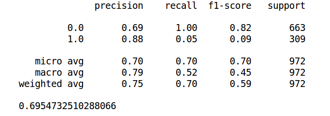
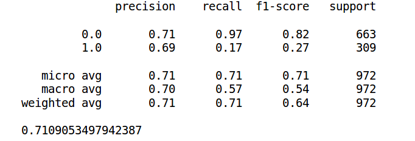
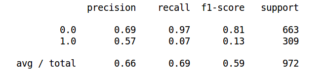
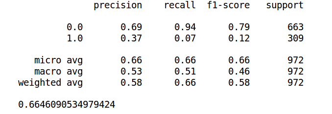
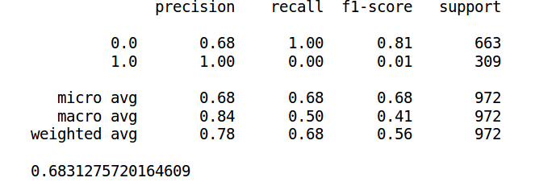
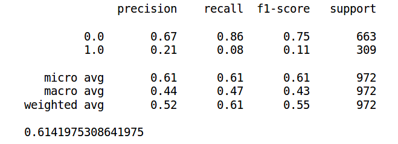
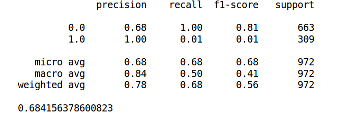
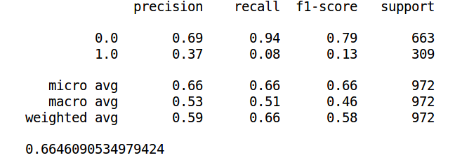
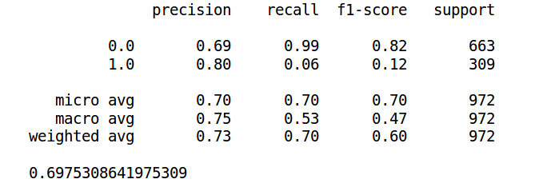

# Paraphrase Detection on Twitter

---

## Goal

Given two tweets, predict whether they are paraphrases of each other

### Team Members

* 20161133 - Sai Kamal Amuluru
* 20161 - Abhishek Nalla
* 20161 - Sowryadeep

## MVP ( Phase-1 of project)

* To find the similarity between two tweets, we need to first find features which encapsulate information related to them.
* Available dataset was reduced to a **binary** dataset to get better results out of the model
* The **features** considered for the above task are
  * **Average sentence vector and cosine distance of the vectors.**
    * Glove vector representations of each word present in a tweet were added and averaged out and cosine distance for both the vectors gives us the similarity between the two tweets.
  * **Word Mover's Distance between the two tweets**
    * WMD adapts the earth mover’s distance to the space of sentences: the distance between two tweets is given by the total amount of “mass” needed to move the words from one side into the other, multiplied by the distance the words need to move.

  * **Wordnet based similarity between nouns of the tweets**
    * We’ve built a symmetric sentence similarity measure only taking nouns into consideration(considering others like verbs did increase accuracy) using WordNet - A lexical database which provides a large repository of English lexical items. 
    * We first obtain the synsets(smallest unit in wordnet) and then we use the hypernym and hyponym relations (like a graph) to obtain the semantic similarity between the nouns.  We have used a path-length based similarity.
    * Drawbacks: As wordnet is essentially a database it doesn’t contain Names and such(proper nouns) which raised a issue as many tweets in the corpus have names which are not included in wordnet and hence no nouns to compare between two tweets. This could be resolved by including verbs and adjectives into consideration for similarity though.
* All these features were then concatenated to obtain a vector of size 3 for each pair of tweets

Two models were trained on these 3 dimensional vectors.

* **Logistic Regression** to obtain a 3 dimensional model.
* **Multi Layer Perceptron** has layers
  1. 128 node layer with relu activation
  2. 128 node layer with relu activation
  3. The final layer with node and the sigmoid activation function.

## Phase-2 of project

In this phase we looked at different research papers on how to improve over model. We came across a paper which used **Long Short Term Memory(LSTM)** to generate the similarity between 2 semantically similar sentences. So we decided to use a **LSTM** neural network as our model, which outputs the similarity of the two tweets in the range of 0-1. The layers used is this layer are

1. First layer is the embedding layers where the word embeddings of each word of the tweet are given as input.
2. The second layer calculates the exponential manhattan distance between the two tweets.
3. The third layer is the sigmoid activation function layer to classify.

The loss function used is the binary cross entropy function to measure classification error.
**Manhattan distance** is used to calculate the similarity between two tweets after obtaining their corresponding embedded vectors.
This can be classified as 1 if the similarity is greater than 0.5 or else 0.

### Results

#### Logistic Regression

#### Multi Layer Perceptron

#### Long Short Term Memory(LSTM)

### Observations

Phase-1 : On training multiple models with only a subset of the features obtained above, we get the following results:

* Feature1 = cosine distance
* Feature2 = Word Mover's distance

* Feature3 = Wordnet based similarity
* Feature 1 
* Feature 2 
* Feature 3 
* Feature 1 Feature 2 
* Feature 1 Feature 3 
* Feature 2 Feature 3 

From the above values we can say that all the above features are equally important and combining them improves the model by a small amount. This might happen because the features are independent of each other and indirectly represent the same thing.

**Note:** some of the code has been run in google colab, so they might not run in system on execution